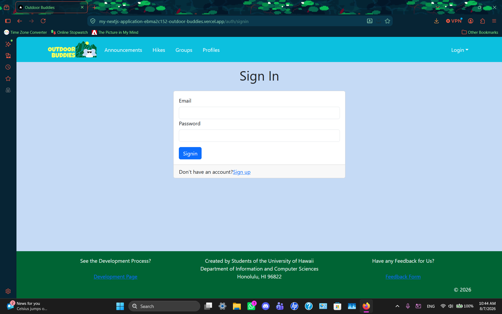
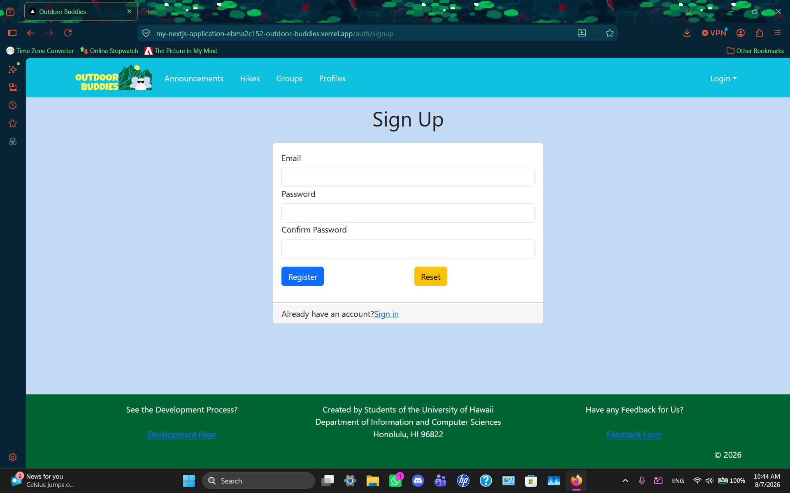
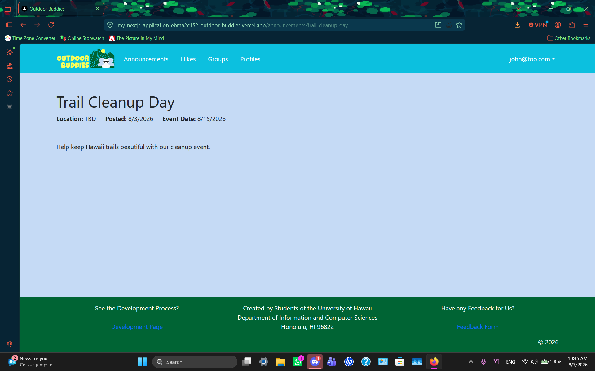
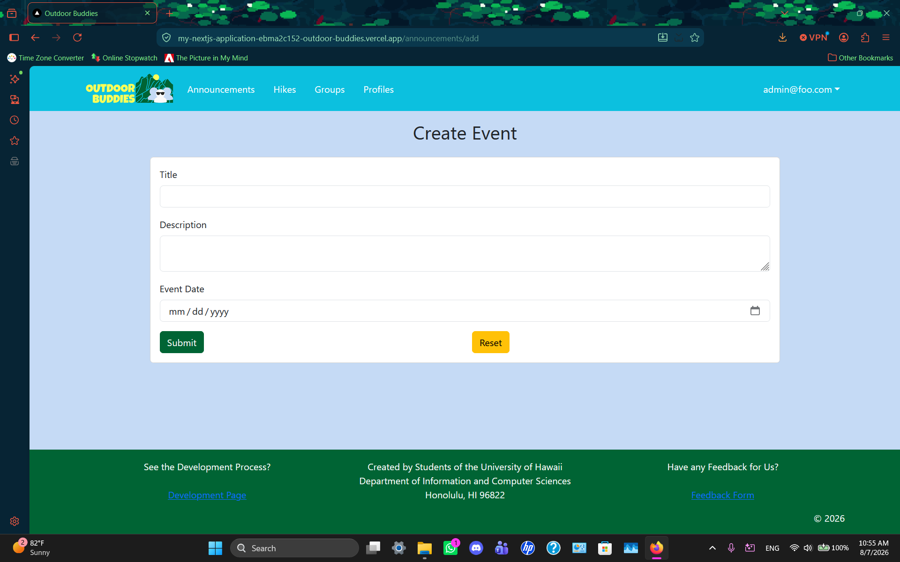
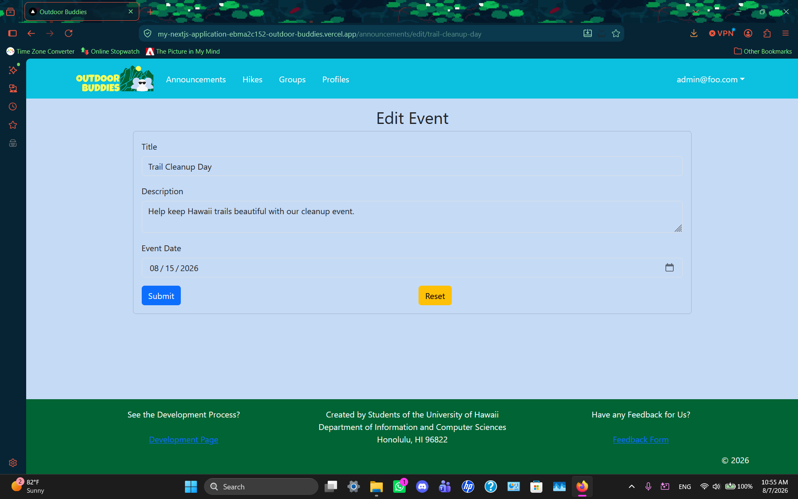

[](https://github.com/outdoor-buddies/my-nextjs-application/actions/workflows/ci.yml)

# Outdoor Buddies

## Table of contents

* [Overview](#overview)
* [Team](#team)
* [Deployment](#deployment)
* [User Guide](#user-guide)
  * [Landing Page](#landing-page)
  * [Sign in and sign up](#sign-in-and-sign-up)
  * [Index pages](#index-pages-announcements-hike-recommendation-groups-profiles)
* [Developer Guide](#developer-guide)
  * [Prerequisites](#prerequisites)
  * [Clone the repository](#clone-the-repository)
  * [Database Setup](#database-setup)
  * [Running the Application](#running-the-application)
* [Development History](#development-history)
  * [Milestone 1: Mockup development](#milestone-1-mockup-development)
  * [Milestone 2: Data model development](#milestone-2-data-model-development)
  * [Milestone 3: Final touches](#milestone-3-final-touches)
* [Team](#team)

---

## Overview

Outdoor Buddies aims to help students find others interested in hiking, running, and walking around Oahu. The application will allow users to create profiles, discover compatible groups and activities, join outdoor events, and share information about local outdoor locations.

The goal is to make outdoor activities more accessible, social, and safer by helping students connect with others who share similar interests and preferences.

### The Problem

ee

### The Solution

ee

---

###

## Deployment

Our application is actively being developed and is deployed via Vercel.  
[View Outdoor Buddies Live](https://my-nextjs-application-nmuczljz2-outdoor-buddies.vercel.app/)

## User Guide

This section provides a walkthrough of the Outdoor Buddies user interface and its capabilities.

### Landing Page

The landing page is presented to users when they visit the top-level URL to the site. This allows users to see what the mission statement of the website is to determine if they would like to utilize its services. There are also user reviews below to see if it is something they might be interested in. (in progress)


### Sign in and sign up

Scroll down and click on the "Sign In" Button or click on the "Login" button in the upper right corner of the Navbar, then select "Sign in" to go to the following page and login. You must have been previously registered with the system to use this option:



Alternatively, you can select "Sign up" in the same locations as "Sign In" to go to the following page and register as a new user:



Upon sign in/sign up, you will be redirected to the Announcements page of the website.

### Index pages (Announcements, Hike Recommendation, Groups, Profiles)

Outdoor Buddies provides four public pages that help users navigate the site in different ways. Users are encouraged to log in to their profiles when trying to access these different pages, and if they do log in they will be able to see what each page has to offer.


The Profiles page shows all the current defined Profiles and their associated Groups:


The announcements page offers the admins a way to interact with users through events and announcements. When a developer is signed in, they have access to a button to create an announcement that will redirect to a form that upon submission, shares with users across the site whether it be events, updates or more.



Users can find out more details through Event Details page.

As mentioned, an admin/developer can add announcements but also edit existing announcements in the announcements page





If an admin feels an announcement is pointless or the date has passed, they can simply press the red trashcan icon on the associated event and delete it.


The Hike Recommendation page shows hikes that people like to do and recommend for newcomers to Hawaii. This is to get a feel for if a certain hike is right for them:  

While it isn't shown, the search function does work and searches by name of the trail and the location. (maybe we'll show can think later)


Users can view more information about a hike including what to bring, what to look out for and more.


The Groups page shows all the currently defined Groups from users on the website with their associated Profile, Interests, and Description.

While it isn't shown, the search function does work and searches by name of the group. (maybe we'll show can think later)


If Users would like to learn more information about the group, they can click on "View Details" and can see more information about the groups


Once users are logged in, they can also create a new group if they would like, especially if they already have some friends in mind and they would like to get new people to join. On the top left, users can click the button and will be and will be redirected to a form:


Users can also edit the group information

Users can also request to join (need to implement this feature though)


The Profiles page shows all the currently defined Profiles on the website with their associated interests and descriptions.

While it isn't shown, the search function does work and searches by name of the profile and other words in the description or summary. (maybe we'll show can think later)


If Users would like to learn more information about different Profiles (other Users), they can click on "View Details" and can see more information about the profiles


Once users are logged in, they can also create a new profile if they would like, especially if they already have some friends in mind and they would like to get new people to join. On the top left, users can click the button and will be and will be redirected to a form:


Users can also edit their profile information

Once logged in a User can select their username in the top right of the Navbar to view their profiles as well (still need to implement is wip)

## Developer Guide

If you are interested in running Outdoor Buddies locally, please follow the instructions below.

### Prerequisites

Before running the application, make sure you have the following installed:

- [Github Desktop](https://desktop.github.com/download/)
- [Node.js](https://nodejs.org/en/download) (Comes with npm)
- [PostgreSQL](https://www.postgresql.org/download/)

Optional:
- [Visual Studio Code](https://code.visualstudio.com/) — Recommended code editor. Other editors or IDEs may be used.

### Clone the repository

Clone the application repository locally using Github Desktop and navigate into the project directory via your editor or IDE and install required dependencies.
```
npm install
```

You will be able to view all of the files associated with the project and edit features or even implement your own!

### Database Setup
Create a PostgreSQL database for the application.
```
createdb name-of-db
```

Copy `sample.env` and rename the copy to `.env` and update the `DATABASE_URL` to match your local PostgreSQL setup

Run database migrations using
```
npx prisma migrate dev
```

Generate the Prisma client:
```
npx prisma generate
```

Seed the database with default users and data:
```
npx prisma db seed
```

### Running the Application

Start the development server by running:
```
npm run dev
```

If properly configured, the app will be available to view at http://localhost:3000

## Development History

### Milestone 1: Mockup development

The goal of [Milestone 1](https://github.com/orgs/outdoor-buddies/projects/1) was to create mockups of each of the pages for our Outdoor Buddies Website

### Milestone 2: Data model development

The goal of [Milestone 2](https://github.com/orgs/outdoor-buddies/projects/3) was to implement the data model: for hikes and for users/groups on the site. We also be fixed certain login issues and added basic features such as searching, adding, editing, etc.

## Milestone 3: Final touches

The goal of [Milestone 3](https://github.com/orgs/outdoor-buddies/projects/4) is to clean up the code base, implement features that we were unable to complete in Milestone 2, have some users test our app while also implementing their suggestions, add more entries into our tables, adjust some of the styles, including fonts, colors etc.

## Team

OutdoorBuddies is designed, implemented, and maintained by [Brycen Kano](https://brycenk05.github.io/) and [Kelly Masaki](https://kellym12.github.io/Professional-Portfolio/).  
Our [Team Contract](https://docs.google.com/document/d/11j764LAw7YHbRscZZDggGGVZIzsIFAGyGOxQO0eoB1g/edit?tab=t.0) is viewable here.
