[](https://github.com/outdoor-buddies/my-nextjs-application/actions/workflows/ci.yml)

# Outdoor Buddies

## Table of contents

* [Overview](#overview)
* [Project](#project)
* [User Guide](#user-guide)
  * [Landing Page](#landing-page)
  * [Sign in and sign up](#sign-in-and-sign-up)
  * [Index pages](#index-pages-announcements-hike-recommendation-groups-profiles)
* [Developer Guide](#developer-guide)
  * [Prerequisites](#prerequisites)
  * [Clone the repository](#clone-the-repository)
  * [Database Setup](#database-setup)
  * [Running the Application](#running-the-application)
* [Community Feedback](#community-feedback)
* [Development History](#development-history)
  * [Milestone 1: Mockup development](#milestone-1-mockup-development)
  * [Milestone 2: Data model development](#milestone-2-data-model-development)
  * [Milestone 3: Final touches](#milestone-3-final-touches)
* [Team](#team)

___

## Overview

Outdoor Buddies aims to help students find others interested in hiking, running, and walking around Oahu. The application will allow users to create profiles, discover compatible groups and activities, join outdoor events, and share information about local outdoor locations.

The goal is to make outdoor activities more accessible, social, and safer by helping students connect with others who share similar interests and preferences.

### The Problem

People love taking hikes, running, and walking in Hawaii. There are many areas and paths with beautiful scenery all around Oahu. Sometimes people don’t feel comfortable hiking, running or walking by themselves, and it can be hard to find a group of people with whom to go.

### The Solution

The Outdoor Buddies App will allow students to login, create a profile marking certain preferences, view pre-existing groups or create a new one, and join with other students on the many beautiful hiking, running, and walking spots on Oahu. They can message each other within the app, post announcements for group hiking events, and create a community.

___

## Project

### Github

View the Outside Buddies Organization [here](https://github.com/outdoor-buddies)

View the Outside Buddies Development Page Repository [here](https://github.com/outdoor-buddies/outdoor-buddies.github.io)

View the Outside Buddies Project Repository [here](https://github.com/outdoor-buddies/my-nextjs-application)

### Deployment

To make Outdoor Buddies easily accessible to anyone, our application is actively being developed and is deployed via Vercel.  
[View Outdoor Buddies Live](https://my-nextjs-application-nmuczljz2-outdoor-buddies.vercel.app/)

___

## User Guide

This section provides a walkthrough of the Outdoor Buddies user interface and its capabilities.

### Landing Page

The landing page is presented to users when they visit the top-level URL to the site. This allows users to see what the mission statement of the website is to determine if they would like to utilize its services. There are also user reviews below to see if it is something they might be interested in. (in progress)

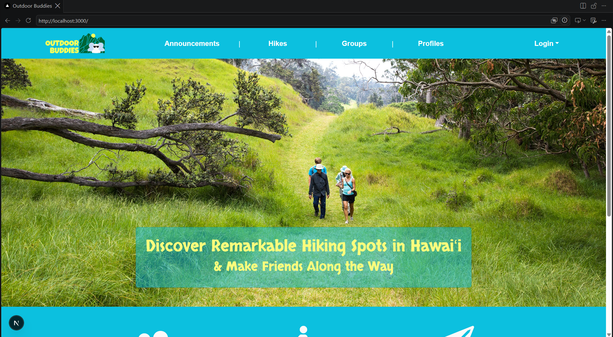
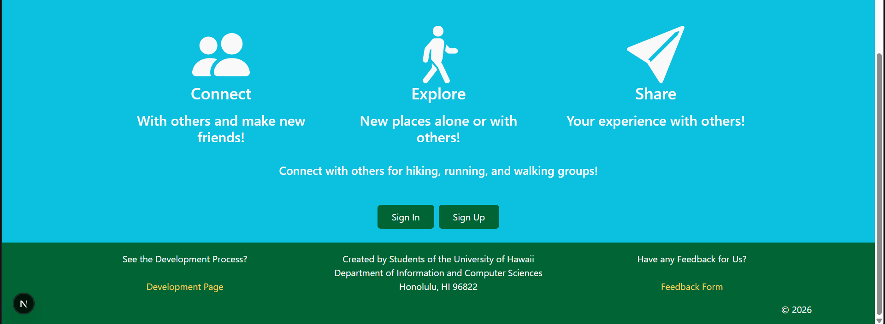

### Sign in and sign up

Scroll down and click on the "Sign In" Button or click on the "Login" button in the upper right corner of the Navbar, then select "Sign in" to go to the following page and login. You must have been previously registered with the system to use this option:

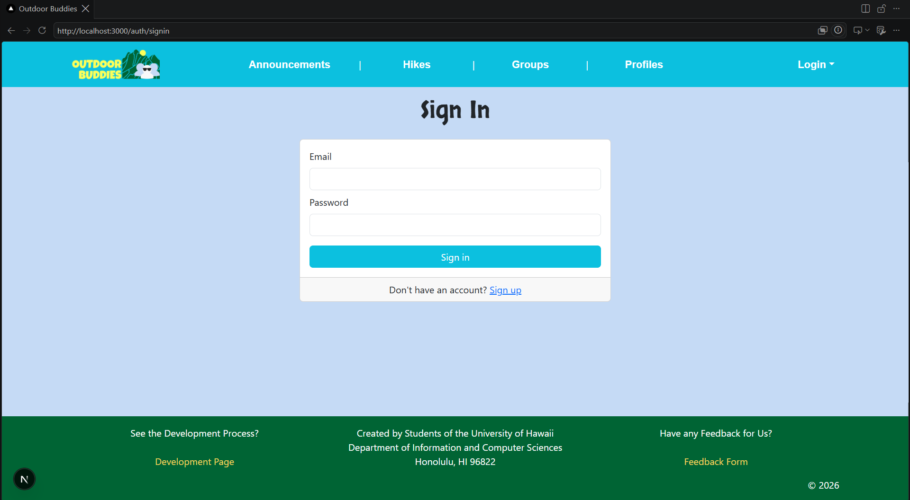

Alternatively, you can select "Sign up" in the same locations as "Sign In" to go to the following page and register as a new user:

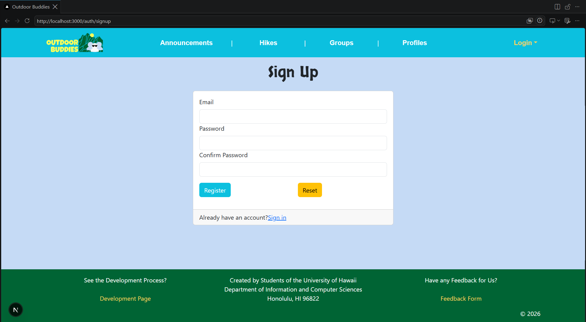

Upon sign in/sign up, you will be redirected to the Announcements page of the website.

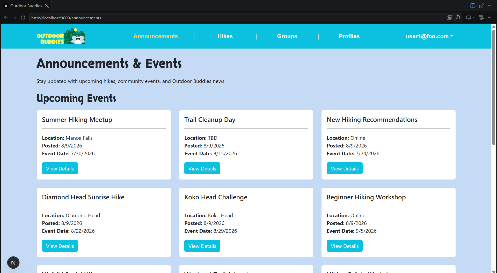

### Index pages (Groups, Profiles)

Outdoor Buddies provides four public pages that help users navigate the site in different ways.

#### Announcements and Events

The Announcements page offers the admins a way to interact with users through Events and Announcements. Users can see new Events that they can join and Admins can post announcements for either upcoming events or changes to the website.


Users can hit the 'View Details' Button on any Event or Announcement to get more information about what is happening and when.

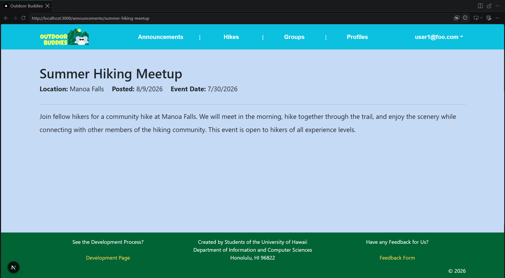

When an admin is signed in, this is what the Announcements and Events page will look like. Admins can connect with Users by sharing events, announcements, updates or more on this page.

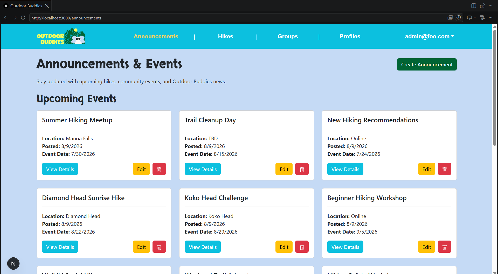

An admin can click on the 'Create Announcement' Button to create a new Event or Announcement and they will be redirected to the form below.

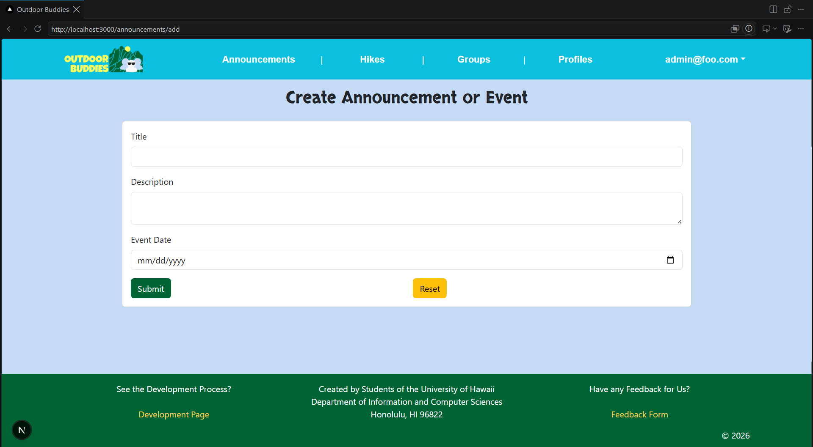

An admin can click on the 'Edit' Button to change the details of the Event or Announcement and they will be redirected to the form below. Editing applies to existing and future Announcements and Events. If an admin notices a mistake on an announcement or the date has passed, They can also click on the 'TrashCan Icon' Button to Delete the specific Event or Announcement

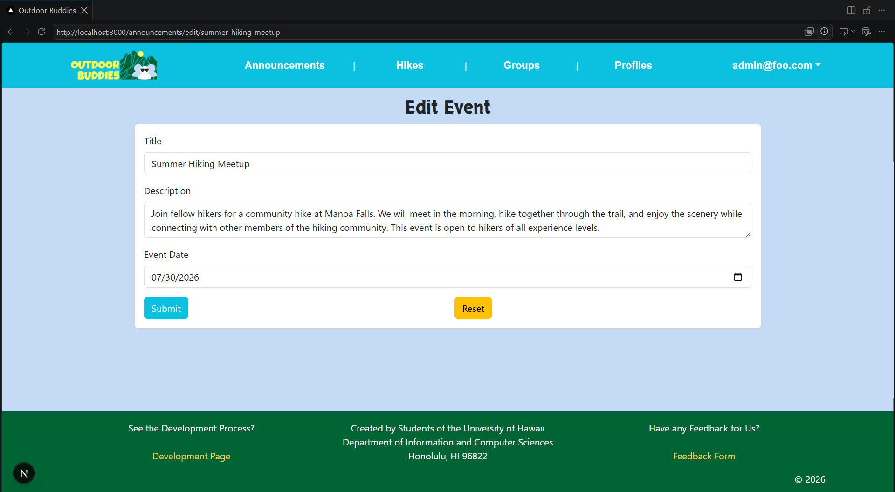

#### List of Hikes

The Hikes page offers users who are new to Hawaii a way to get more information on the different hikes that people can do on Oahu. 

Users are encouraged to log in to their profiles when trying to access these different pages, and if they do log in they will be able to see what each page has to offer.

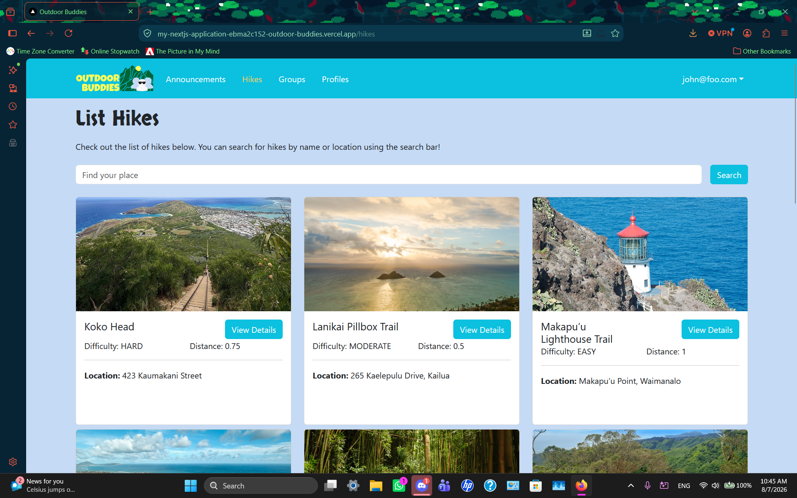

The Hike Recommendation page shows hikes that people like to do and recommend for newcomers to Hawaii. This is to get a feel for if a certain hike is right for them:  

While it isn't shown, the search function does work and searches by name of the trail and the location. (maybe we'll show can think later)

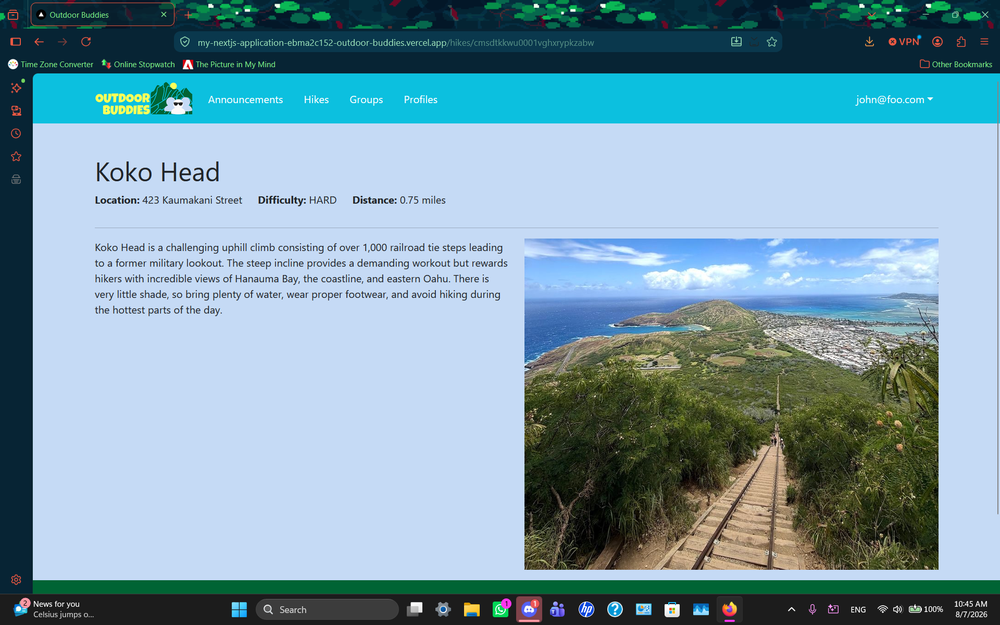

Users can view more information about a hike including what to bring, what to look out for and more.

#### Groups

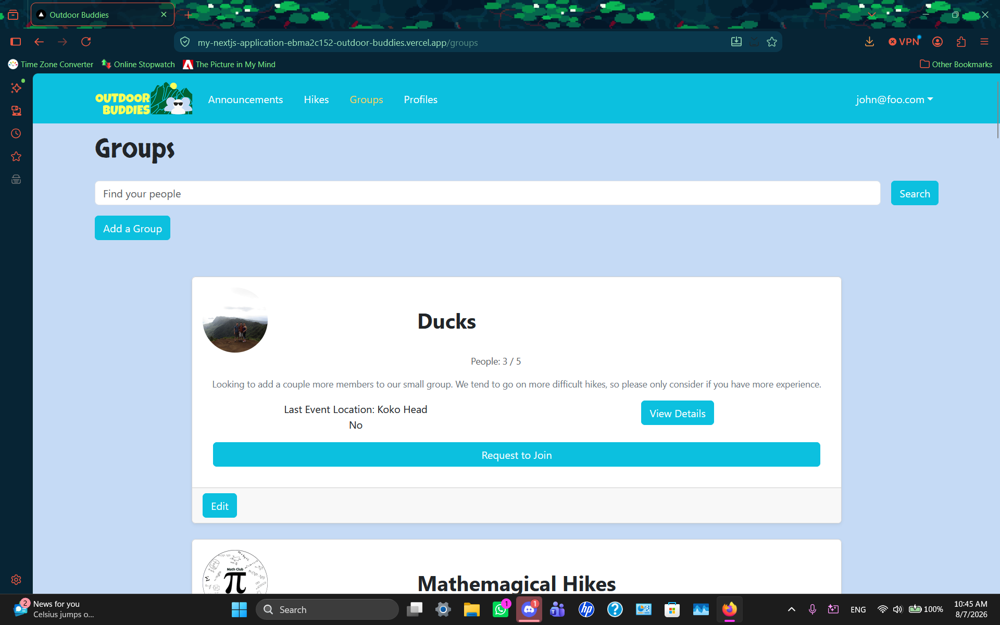

The Groups page shows all the currently defined Groups from users on the website with their associated Profile, Interests, and Description.

While it isn't shown, the search function does work and searches by name of the group. (maybe we'll show can think later)


If Users would like to learn more information about the group, they can click on "View Details" and can see more information about the groups

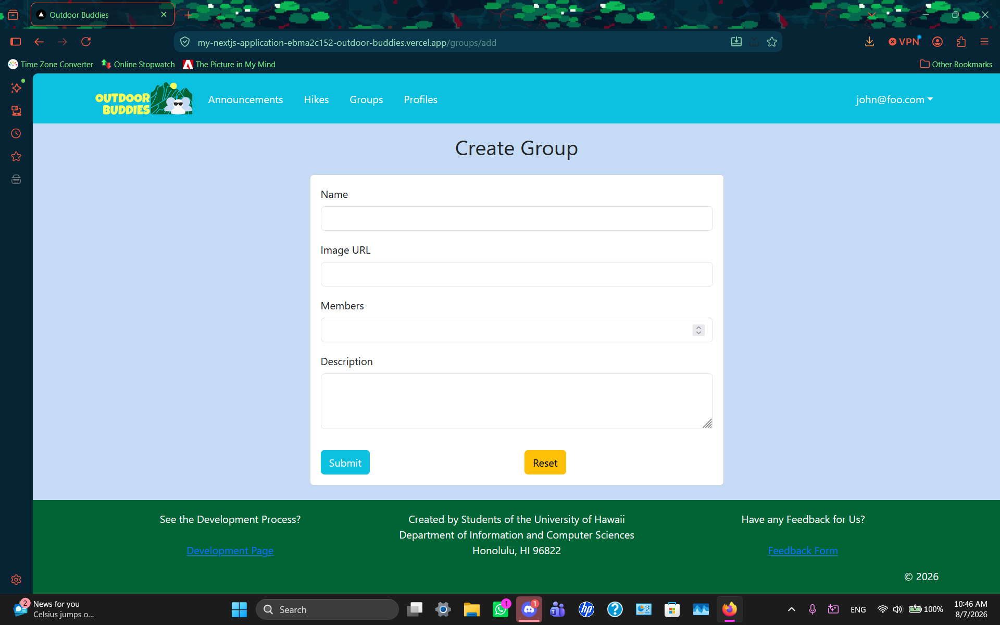

Once users are logged in, they can also create a new group if they would like, especially if they already have some friends in mind and they would like to get new people to join. On the top left, users can click the button and will be and will be redirected to a form:

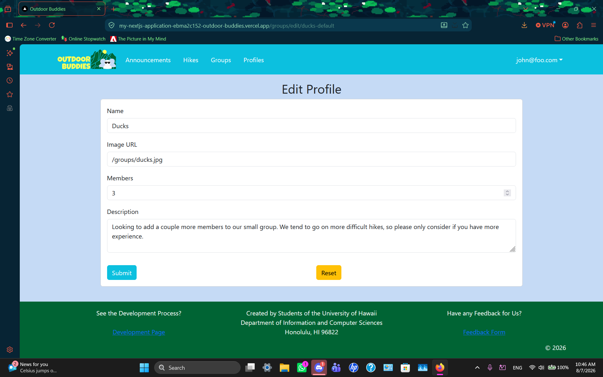

Users can also edit the group information

Users can also request to join (need to implement this feature though)

#### Profiles

The Profiles page shows all the current defined Profiles and their associated Groups:

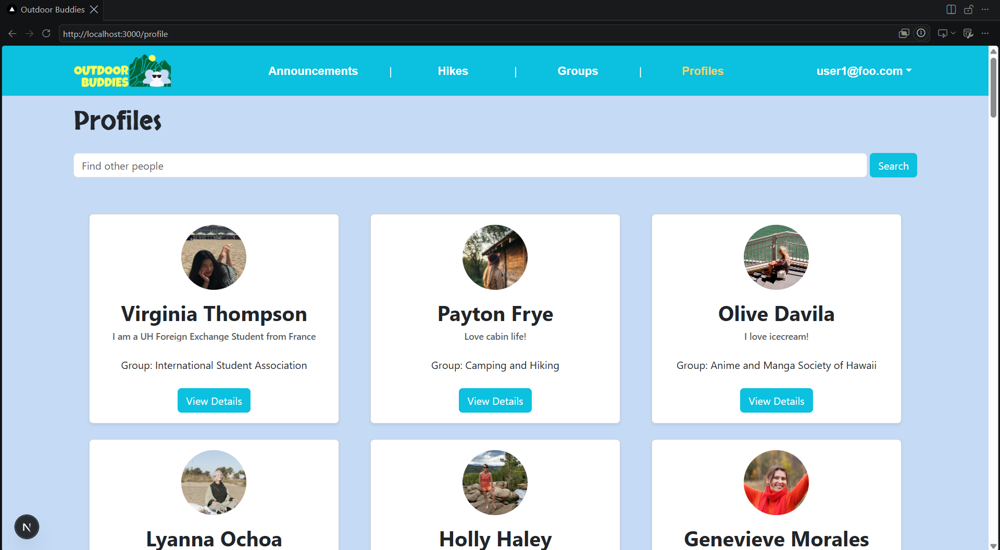


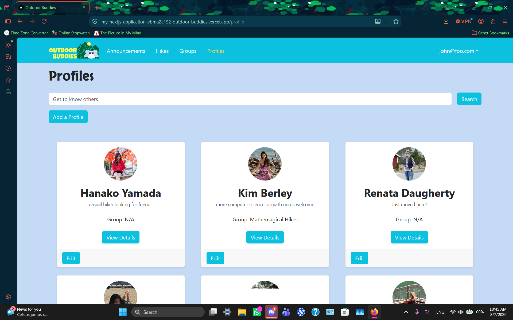

The Profiles page shows all the currently defined Profiles on the website with their associated interests and descriptions.

While it isn't shown, the search function does work and searches by name of the profile and other words in the description or summary. (maybe we'll show can think later)


If Users would like to learn more information about different Profiles (other Users), they can click on "View Details" and can see more information about the profiles

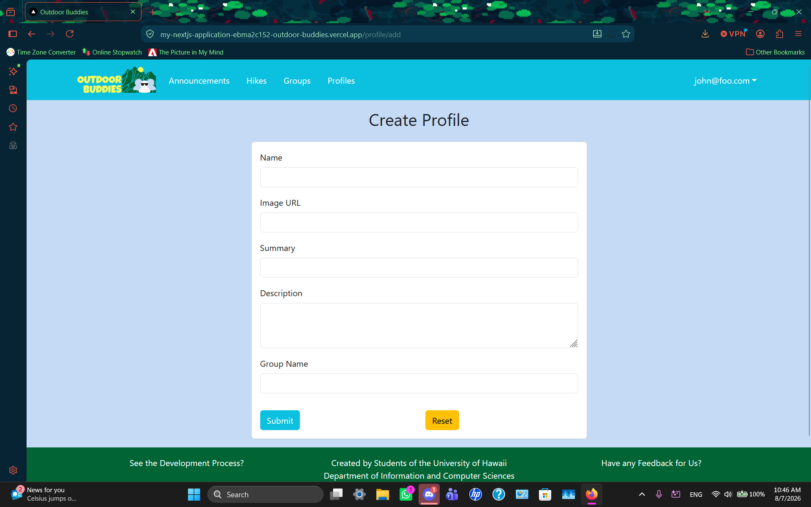

Once users are logged in, they can also create a new profile if they would like, especially if they already have some friends in mind and they would like to get new people to join. On the top left, users can click the button and will be and will be redirected to a form:

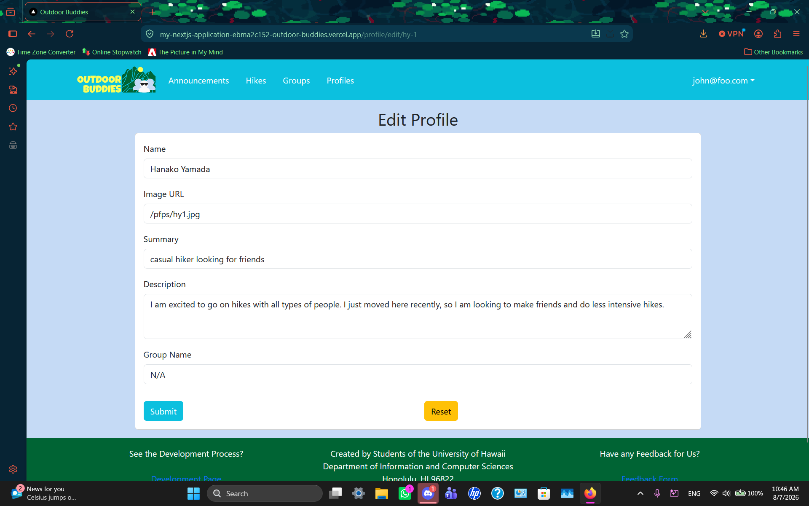

Users can also edit their profile information

Once logged in a User can select their username in the top right of the Navbar to view their profiles as well (still need to implement is wip)

___

## Developer Guide

If you are interested in running Outdoor Buddies locally, please follow the instructions below.

### Prerequisites

Before running the application, make sure you have the following installed:

- [Latest Node.js](https://nodejs.org/en/download) (Comes with npm)
- [Latest PostgreSQL](https://www.postgresql.org/download/)
- [Latest Git](https://git-scm.com/book/en/v2/Getting-Started-Installing-Git)
- Code Editor

### Optional

These are reccomended to make navigation and seeing components easier

- Code Editor (Reccomended): [VSCode](https://code.visualstudio.com/Download?_exp_download=fb315fc982) (although other editors or IDES may be used)
- [Github Desktop](https://desktop.github.com/download/)
- [pgAdmin](https://www.pgadmin.org/download/)

### Clone the repository

Clone the application repository locally using Github Desktop and navigate into the project directory via your editor or IDE and install required dependencies.

### Install Dependencies

```
npm install
```

You will be able to view all of the files associated with the project and edit features or even implement your own!

### Environment Setup

This project requires a .env file for...

NextAuth configuration
Database connection (PostgreSQL)
Prisma
Session keys
figure out how to rephrase above

Create a `.env` file ...

### Database Setup
Create a PostgreSQL database for the application.
```
createdb name-of-db
```

Copy `sample.env` and rename the copy to `.env` and update the `DATABASE_URL` to match your local PostgreSQL setup

Run database migrations using
```
npx prisma migrate dev
```

Generate the Prisma client:
```
npx prisma generate
```

Seed the database with default users and data:
```
npx prisma db seed
```

### Running the Application

Start the development server by running:
```
npm run dev
```

If properly configured, the app will be available to view at http://localhost:3000

___

## Community Feedback

We asked 5 members of the UH Community to try to test the Outside Buddies web application on both the user and the dev end. For each community member, we hav split their answer into the categories: 'General Impressions', 'Things that I liked', 'Things that could be improved'


___

## Development History

### Milestone 1: Mockup development

The goal of [Milestone 1](https://github.com/orgs/outdoor-buddies/projects/1) was to create mockups of each of the pages for our Outdoor Buddies Website. Specifically Announcements(/Events), Hikes, Groups, and Profiles.

### Milestone 2: Data model development

The goal of [Milestone 2](https://github.com/orgs/outdoor-buddies/projects/3) was to implement the data model: for Announcements(/Events), Hikes, and for Groups and Profiles (especially connecting them to a specific User) on the site. We also fixed certain login issues, transferring to the vercel deployment database, and added basic features, such as searching, adding, editing, and deleting functions. Users can add, edit, and delete Groups and Profiles. Admins can add, edit, and delete Announcements(/Events) and Hikes.

## Milestone 3: Final touches

The goal of [Milestone 3](https://github.com/orgs/outdoor-buddies/projects/4) is to clean up the code base, implement features that we were unable to complete in Milestone 2, have some users test our app while also implementing their suggestions, add more entries into our tables, adjust some of the styles, including fonts, colors etc. We added in a dynamic search that can filter based on certain components for both Hikes and Groups. Groups also now has a Forum Page where users can post asking a group some questions or to request to join.

## Team

OutdoorBuddies is designed, implemented, and maintained by [Brycen Kano](https://brycenk05.github.io/) and [Kelly Masaki](https://kellym12.github.io/Professional-Portfolio/).  

Our [Team Contract](https://docs.google.com/document/d/11j764LAw7YHbRscZZDggGGVZIzsIFAGyGOxQO0eoB1g/edit?tab=t.0) is viewable here.

Our [Effort Estimation Log](https://docs.google.com/spreadsheets/d/1eeu1O1KRPOSeJ9_-fLJdqsYPwT55wFt2rFn6RpRWpBE/edit?gid=0#gid=0) is viewable here.

Our [Feedback Form](https://docs.google.com/forms/d/1s5giYVxxcc7z6MaEk2tQkjkACl2sGNaz3vUJycFOI5g/edit) for if you would like to give us any feedback.