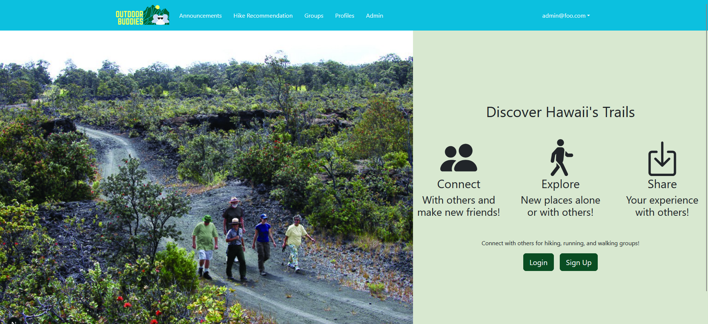
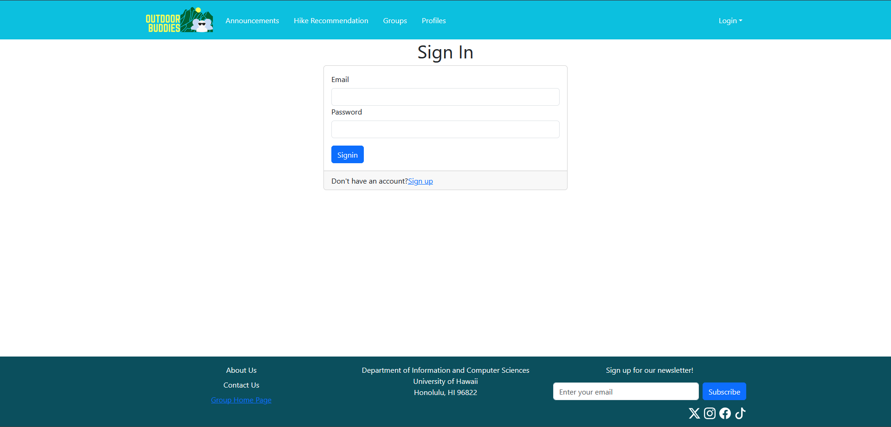
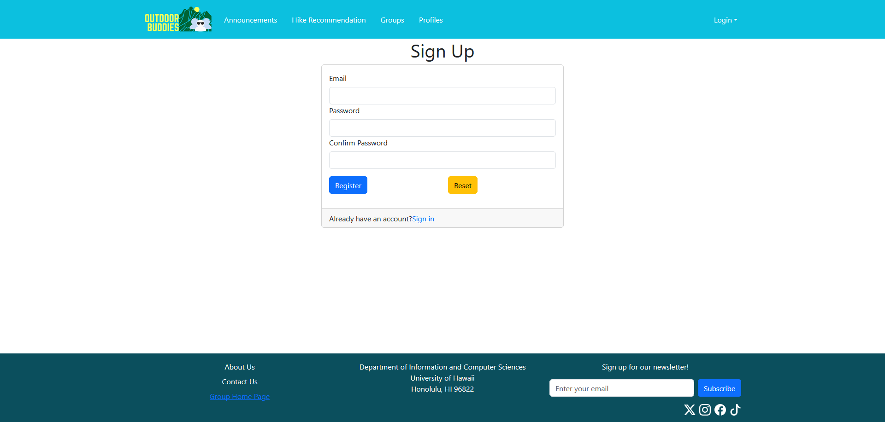
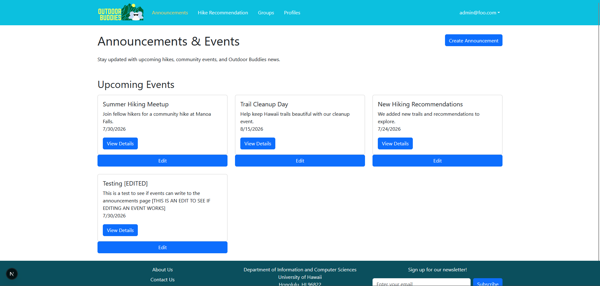
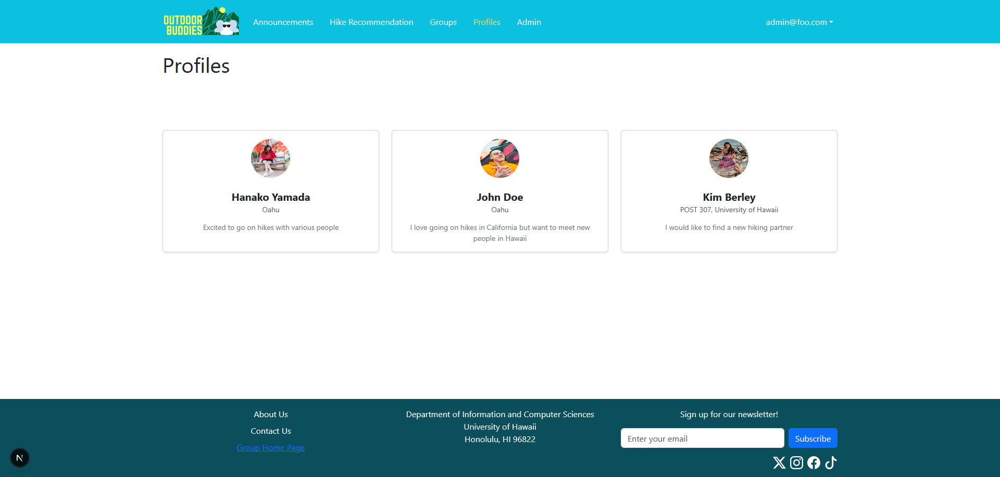
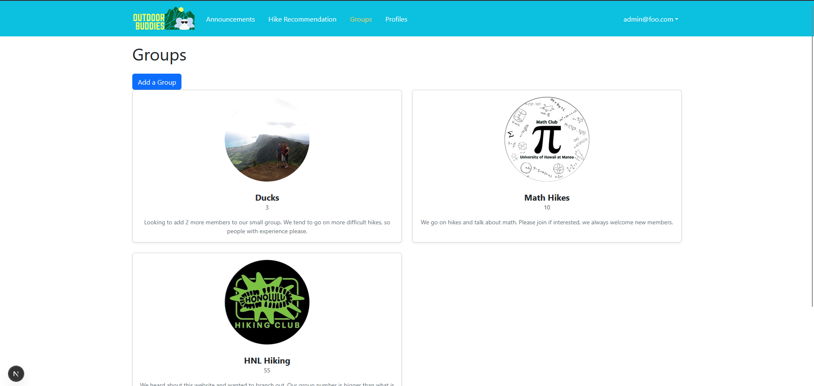
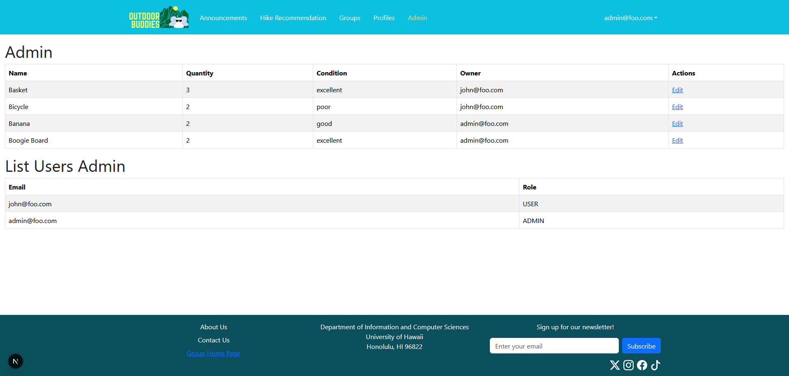

# Outdoor Buddies

## Table of contents

* [Overview](#overview)
* [Deployment](#deployment)
* [User Guide](#user-guide)
* [Development History](#development-history)
* [Team](#team)

## Overview

### Project Goals

Outdoor Buddies aims to help students find others interested in hiking, running, and walking around Oahu. The application will allow users to create profiles, discover compatible groups and activities, join outdoor events, and share information about local outdoor locations.

The goal is to make outdoor activities more accessible, social, and safer by helping students connect with others who share similar interests and preferences.

## Deployment

Our application is actively being developed and is deployed via Vercel.  
[View Outdoor Buddies Live](https://my-nextjs-application-2w45ow2b3-outdoor-buddies.vercel.app/)

## User Guide

This section provides a walkthrough of the Outdoor Buddies user interface and its capabilities.

### Landing Page

The landing page is presented to users when they visit the top-level URL to the site.

### Sign in and sign up

Click on the "Login" button in the upper right corner of the navbar, then select "Sign in" to go to the following page and login. You must have been previously registered with the system to use this option:

Alternatively, you can select "Sign up" to go to the following page and register as a new user:

### Index pages (Announcements, Hike Recommendation, Groups, Profiles)

Outdoor Buddies provides four public pages that help users navigate the site in different ways.

The Profiles page shows all the current defined profiles and their associated Groups:

The announcements page offers the admins a way to interact with users through events and announcements. When a developer is signed in, they have access to a button to create an announcement that will redirect to page where they can input info to share with users whether it be events, updates or more.

The Hike Reccomendation page shows hikes that people like to do and reccomend for newcomers to Hawaii. This is to get a feel for if a certain hike is right for them:  
put image here

Finally, the Announcements page which shows any updates made by the Administrators as well as events that are being hosted outside of the website:

The Groups page shows all the currently defined Groups from users on the website with their associated Profile, Interests, and Description:

### Admin page

While undecided, we have kept the admin page in case of reference and for proof of sign in protection working properly. However, we are facing issues with signing in on the deployed vercel site, an issue that we aim to address in M2

### Home page

After logging in, you are taken to the home page, which presents a form where you can complete and/or update your personal profile:

work in progress

### Request to join Group

Once you are logged in, you can request to join different Groups:  

work in progress

## Development History

### Milestone 1: Mockup development

The goal of Milestone 1 was to create mockups of each of the pages for our Outdoor Buddies Website

### Milestone 2: Data model development

The goal of Milestone 2 is to implement the data model: the underlying set of Mongo Collections and the operations upon them that would support the BowFolio application.

## Milestone 3: Final touches

The goal of Milestone 3 is to clean up the code base and fix minor UI issues.

## Team

OutdoorBuddies is designed, implemented, and maintained by [Brycen Kano](https://brycenk05.github.io/) and [Kelly Masaki](https://kellym12.github.io/Professional-Portfolio/).  
Our [Team Contract](https://docs.google.com/document/d/11j764LAw7YHbRscZZDggGGVZIzsIFAGyGOxQO0eoB1g/edit?tab=t.0) is viewable here.
